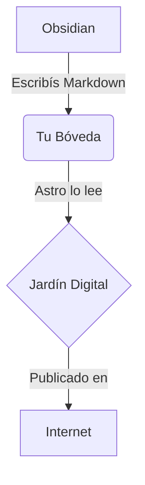

¡Bienvenido a tu primer post!

Podés escribir en **Markdown** como siempre lo hacés.

## Funcionalidades

Gracias a los plugins que configuramos, podés usar:

### Callouts de Obsidian

[!NOTE]
Esto es un callout. Es útil para resaltar información importante.

[!TIP] Título personalizado
Los callouts también pueden tener títulos.

### Fórmulas Matemáticas

Podés escribir matemáticas inline como $E=mc^2$ y también en bloque:

$$
\frac{\partial \mathcal{L}}{\partial (\partial_\mu \phi)} - \partial_\mu \frac{\partial \mathcal{L}}{\partial (\partial_\mu \phi)} = 0
$$

### Diagramas de Mermaid

