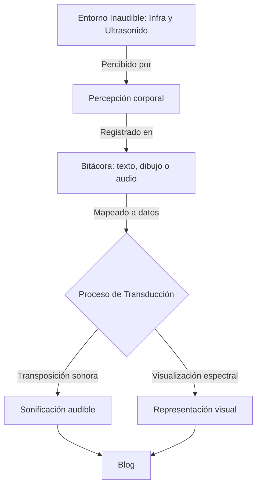

# El cuerpo como sensor: hacia una sonificación de lo inaudible  

Este texto inaugura mi exploración sobre la **percepción del sonido más allá del oído**.  
Un punto de partida hacia lo que podría convertirse en una obra, una bitácora sensorial o un estudio especulativo sobre **cómo lo inaudible se transforma en experiencia**.

---

## Sinopsis

> “Lo que no escuchamos, también nos atraviesa.”  

Me interesa investigar cómo **las ondas infrasónicas y ultrasónicas**, invisibles para la percepción auditiva humana, pueden ser **traducidas, transducidas o sentidas**.  
Este proyecto no busca registrar con exactitud física, sino **interpretar corporalmente** la vibración del entorno.  
La **Central Nuclear Atucha** se perfila como un territorio simbólico: un espacio donde la energía invisible, contenida y vibrante, se vuelve metáfora de lo inaudible.

---

## Paradigma operativo

> [!NOTE]
> **Paradigma:** Transducción sensorial.  
> **Definición:** Conversión de energía o estímulos imperceptibles en señales sensibles (sonido, luz, imagen o palabra).

La idea central es que el **cuerpo humano funciona como un instrumento de medida**.  
Cada sensación registrada —presión, calor, vibración, silencio, ansiedad, resonancia— será tratada como **dato sonoro**.  
La *sonificación* se construirá como una traducción de esas percepciones, más cercana a la poesía que a la física.

---

## Representación del proceso

