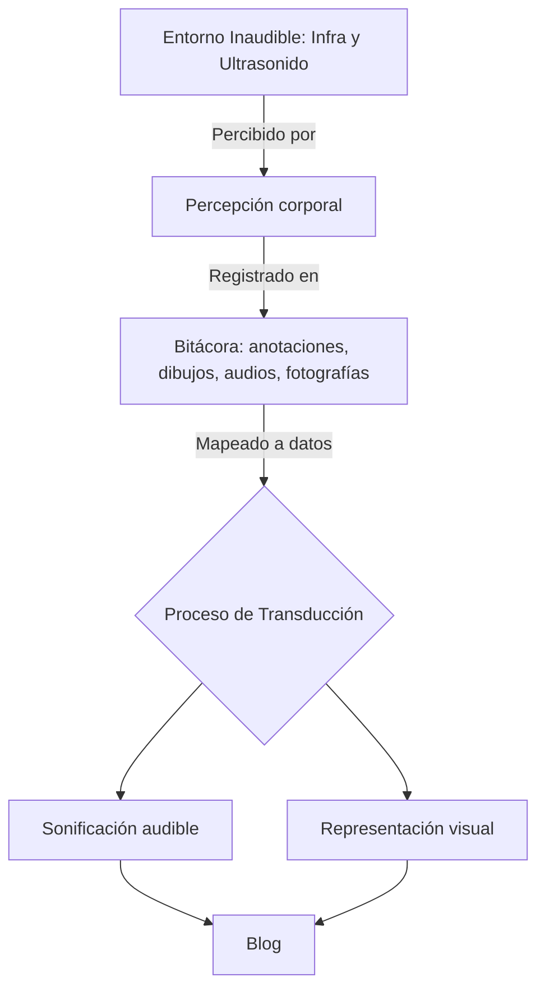

#### Exploración sobre la transducción sensorial y la sonificación de lo infrasonoro y ultrasónico.

## El cuerpo como sensor: hacia una sonificación de lo inaudible
Este texto inaugura mi exploración sobre la percepción del sonido más allá del oído.  
Un punto de partida hacia lo que podría convertirse en una obra, una bitácora sensorial o un estudio especulativo sobre cómo lo inaudible se transforma en una experiencia.

---
## Sinopsis

Me interesa investigar cómo las ondas infrasónicas y ultrasónicas, invisibles para la percepción auditiva humana, pueden ser traducidas, transducidas o sentidas.  
Este proyecto no busca registrar con exactitud, sino que busca el ver como se interpretan corporalmente las frecuencias y la vibración del entorno.  
La Central Nuclear Atucha se perfila como un territorio simbólico, un espacio donde la energía invisible, contenida y vibrante, se vuelve representación de una obra sonovisual.

---
## Paradigma operativo

La idea central es que el cuerpo humano funciona como un instrumento de medida.  
Cada sensación registrada presión, calor, vibración, silencio, ansiedad, resonancia será tratada como dato.  
La sonificación se construirá como una traducción de esas percepciones.

---

## Representación del proceso

