# El cuerpo como sensor: hacia una sonificación de lo inaudible  

Este texto inaugura mi exploración sobre la **percepción del sonido más allá del oído**.  
Un punto de partida hacia lo que podría convertirse en una obra, una bitácora sensorial o un estudio especulativo sobre **cómo lo inaudible se transforma en experiencia**.

---

## 🌌 Sinopsis

> “Lo que no escuchamos, también nos atraviesa.” 

Me interesa investigar cómo **las ondas infrasónicas y ultrasónicas**, invisibles para la percepción auditiva humana, pueden ser **traducidas, transducidas o sentidas**.  
Este proyecto no busca registrar con exactitud física, sino **interpretar corporalmente** la vibración del entorno.  
La **Central Nuclear Atucha** se perfila como un territorio simbólico: un espacio donde la energía invisible, contenida y vibrante, se vuelve metáfora de lo inaudible.

---

## 🧭 Paradigma operativo

> [!NOTE]
> **Paradigma:** Transducción sensorial.  
> **Definición:** Conversión de energía o estímulos imperceptibles en señales sensibles (sonido, luz, imagen o palabra).

La idea central es que el **cuerpo humano funciona como un instrumento de medida**.  
Cada sensación registrada —presión, calor, vibración, silencio, ansiedad, resonancia— será tratada como **dato sonoro**.  
La *sonificación* se construirá como una traducción de esas percepciones, más cercana a la poesía que a la física.

---

## ⚙️ Representación del proceso

```mermaid
graph TD;
    A[Entorno Inaudible: Infra y Ultrasonido] -->|Percibido por| B[Percepción corporal];
    B -->|Registrado en| C[Bitácora: texto, dibujo o audio];
    C -->|Mapeado a datos| D{Proceso de Transducción};
    D -->|Transposición sonora| E[Sonificación audible];
    D -->|Visualización espectral| F[Representación visual];
    E -->G[Blog];
    F -->G;


```

